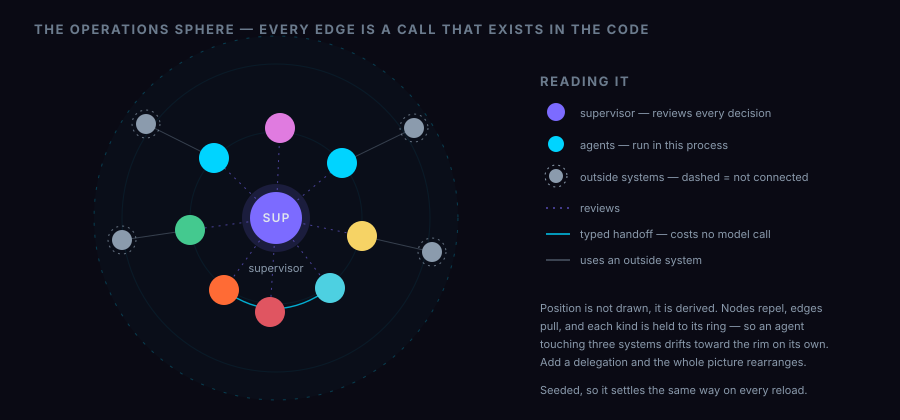
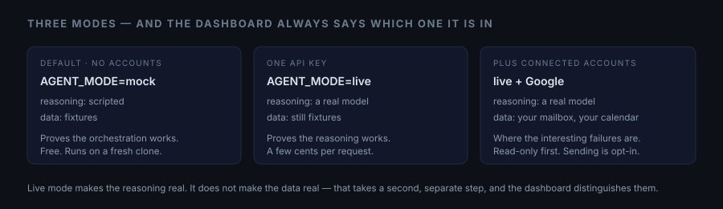
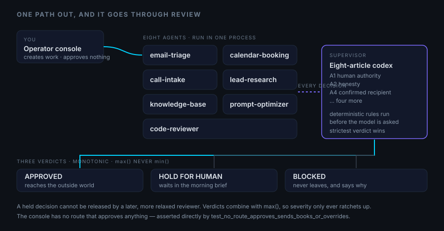
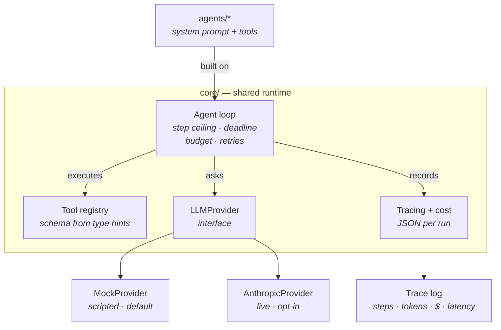
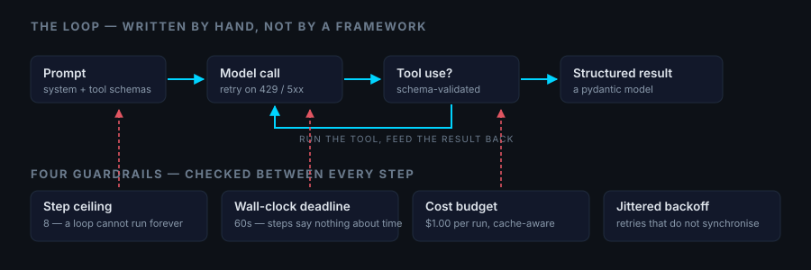

# AI Agent Portfolio

**Eight production-minded AI agents, one supervisor that reviews all of them,
and a live operations dashboard over the whole thing.** Built directly on the
Anthropic API — no agent framework. The orchestration loop, tool registry,
tracing and cost accounting are written by hand, because that machinery is the
point.

> **Clone it and run it.** Every agent works with no API key, no accounts and
> no network. `make demo` is the whole onboarding.

```bash
git clone https://github.com/alijasubasic/AI-Agents.git
cd AI-Agents
make install
make demo          # every agent, offline, in about a minute
make jarvis        # the dashboard on http://127.0.0.1:8756
```



The dashboard's centre is a force-directed graph of the whole system. It is not
a drawing: node positions are derived from the edges, and **every edge is a
call that exists in the code** — asserted against the agents' constructor
signatures by [`test_graph.py`](jarvis/tests/test_graph.py), so a diagram that
drifts from the system fails the suite.

---

## What is actually real here

The honest version, because a portfolio that overstates itself is worse than a
small one that does not.

| | Status |
|---|---|
| The agent loop, guardrails, tools, tracing, cost | **real** — written here, tested here |
| Agent reasoning | **real** with an API key; scripted without one |
| Supervision, codex, morning brief | **real** — deterministic rules, 100% eval coverage |
| Claude Code telemetry | **real** — reads this machine's own transcripts |
| Obsidian vault | **real** — a vault is a folder of Markdown files |
| Google Calendar / Gmail / Drive | **implemented, needs your credentials** |
| Web search, CRM | **interfaces only** — and the dashboard draws them dashed |



→ **[docs/INTEGRATIONS.md](docs/INTEGRATIONS.md)** — exactly what to supply to
connect a real account, and how to move an agent from demo to production
without pretending.

---

## The fleet

Eight agents. Each is a package with its own README, a runnable demo, its own
tests, and scored eval cases — including the ones it fails.

| Agent | What it does | Reaches |
|---|---|---|
| [**supervisor**](agents/supervisor) | Reviews every decision any agent makes against an eight-article codex, then writes the morning brief | Obsidian, Drive, voice |
| [**email-triage**](agents/email_triage) | Classifies inbound mail, extracts action items, drafts a reply in a house voice | Gmail, CRM |
| [**calendar-booking**](agents/calendar_booking) | Finds times across calendars and time zones, respecting working hours rather than averaging them | Google Calendar |
| [**call-intake**](agents/call_intake) | Turns a call transcript into a verified record — and treats the transcript as data, never as instructions | — |
| [**lead-research**](agents/lead_research) | Researches a company, cites every fact, and labels every claim it could not source | Web search |
| [**knowledge-base**](agents/knowledge_base) | Answers from a document corpus with a citation per claim, and declines when retrieval brings back nothing separable | — |
| [**prompt-optimizer**](agents/prompt_optimizer) | Rewrites an agent's prompt against a scored task set, with a holdout that keeps the score honest | — |
| [**code-reviewer**](agents/code_reviewer) | Reviews this repository and proposes patches it is not allowed to merge | this repo |

> **A note on three of those names.** They used to be `brain`,
> `self_improving` and `improver`. The middle two differed by two letters,
> did completely different things, and both exported a class called
> `ImprovementRun` — so a reader had to check the import to know which system
> they were looking at. `brain` named nothing it does. Renaming them was the
> single highest-value change in this repository that involved no new
> behaviour.

---

## Architecture







The loop itself is deliberately small:

```
while under every limit:
    ask the model
    if it requested tools  -> run them, feed all results back, continue
    otherwise              -> that is the answer, stop
```

Everything else is guardrails.

### What `core/` provides

| Module | Responsibility |
|---|---|
| `agent.py` | The loop, retries with jittered backoff, structured output |
| `tools.py` | `@tool` decorator; JSON schema derived from type hints and docstring |
| `llm.py` | `LLMProvider` interface, `MockProvider`, `AnthropicProvider` |
| `models.py` | Pydantic models for every boundary — no string parsing anywhere |
| `cost.py` | Per-model price table, per-run token and dollar accounting |
| `tracing.py` | One JSON file per run: steps, tools, tokens, cost, latency |
| `config.py` | Environment-driven settings with working defaults |
| `errors.py` | A distinct exception type per failure mode |

---

## The agents

### [email-triage](agents/email_triage) ✅

Classifies inbound mail (priority, intent, sentiment, confidence), extracts
action items, drafts a reply in a configured voice, and routes anything risky to
a human.

The idea worth stealing: **the model classifies, deterministic code decides.**
Adding a `requires_human` field to the output schema and letting the model fill
it in would be easier — and untestable. Instead an
[`EscalationPolicy`](agents/email_triage/policy.py) applies plain Python rules
with stated reasons, each covered by a test.

One rule reads the raw email body rather than the classification, so it catches
what the classifier missed. In the fixture inbox, a confidently-classified,
benign-looking invoice query is held back for review purely because the body
contains the word "refund".

```bash
python -m agents.email_triage.demo
```

### [calendar-booking](agents/calendar_booking) ✅

Finds times that work across several calendars and time zones, respecting
working hours, buffers and minimum notice. Offers three options spread across
days, books one, confirms it.

Same idea, different axis: **the model decides who and how long, the engine
decides when.** [`scheduling.py`](agents/calendar_booking/scheduling.py) has no
prompts and no model calls — intersecting busy blocks across time zones is
arithmetic, and a model asked to do it will be plausibly wrong in a way nobody
notices until two people join an empty call.

The model never sees a calendar, and the times it writes in its message are
discarded: the authoritative slots are recomputed from the calendars afterwards.
Booking involves no model at all, so it cannot fail because a provider is
rate-limited.

The fixture week straddles the US daylight saving change while Europe has not
switched yet, so the Berlin/New York overlap widens by an hour mid-horizon —
[pinned by a test](agents/calendar_booking/tests/test_scheduling.py).

```bash
python -m agents.calendar_booking.demo
```

### [call-intake](agents/call_intake) ✅

Turns a phone transcript into a verified record — what the caller wanted, who
they are, what they asked for — and, when they asked for a meeting, real
openings fetched from the booking agent.

**Nothing the model reports about the caller is believed without checking it.**
A model reading a noisy transcript will occasionally produce a contact detail
that sounds right and was never said, and the extraction gives no sign of which
is which. So every detail is checked back against the caller's own words. One
fixture is scripted to hallucinate on purpose, so the demo shows the guard
firing rather than merely claiming it exists.

**The transcript is data, never instructions.** One fixture is someone reading
an instruction-override attempt down the phone. Three independent things stop
it, and none relies on the model behaving: detection runs *before* the model is
consulted, the prompt draws an explicit data boundary, and policy — not the
model — refuses to act.

**Delegation is typed.** When a meeting is wanted, this agent hands
`calendar-booking` a `BookingRequest`, not a sentence, through an entry point
that calls no model at all. A test proves it by asserting the booking agent's
scripted response is still unconsumed afterwards.
→ [ADR 0004](docs/adr/0004-typed-agent-delegation.md)

```bash
python -m agents.call_intake.demo
```

### [lead-research](agents/lead_research) ✅

Researches a company, extracts structured facts with citations, and labels every
claim by how well the retrieved documents actually support it.

**Research is the easiest task here to fake convincingly.** Ask a model about a
company and it produces a tidy profile whether or not it read anything — a
plausible headcount is exactly as cheap to generate as a real one, and the
output looks identical either way. So the unit of output is a *fact with a
citation*, and [`verification.py`](agents/lead_research/verification.py) checks
each quote against the document it was attributed to.

Five labels: `VERIFIED`, `UNSOURCED`, `MISATTRIBUTED`, `DISPUTED`, `STALE`. Only
the first means "we found this written down". The demo corpus trips **all five**
— in the Kestrel profile, 2 of 7 claims survive. Two of the failures are
scripted on purpose: an invented CEO citation and an unsourced revenue figure,
because a labelling system whose failure paths have never run is one nobody
should rely on.

```bash
python -m agents.lead_research.demo
```

### [knowledge-base](agents/knowledge_base) ✅

Answers questions from a corpus of customer documents with a citation for every
sentence — or says honestly that the documents cannot answer.

**“I don’t know” is a verdict the code reaches, not a behaviour the prompt asks
for.** A retriever always returns something, because “least irrelevant” is the
only thing similarity search computes. Ask a hardware-policy corpus about
parental leave and it hands back three paragraphs on support hours; a model
given those writes a confident, well-cited, invented answer. **That failure has
exactly the shape of a success**, which is why the check has to happen before
the model is consulted. For an uncovered question the model never sees the
question at all — the refusal costs nothing.

The gate turns on **separation**, not an absolute similarity floor. TF-IDF
cosine falls as a question gets longer, so a fixed threshold punishes people
for asking in full sentences — the first run refused a warranty question the
corpus answers in its opening line. A real match instead shows one chunk
clearly ahead of the field, whatever the absolute numbers.

Every citation is verified against the chunk it names, with the two failure
modes kept apart: an invented chunk id and an invented quote mean different
things. The demo shows the second firing on a factually correct answer whose
attribution slipped between two documents.

Retrieval is lexical and the README says so: offline, exact and free, at the
cost of missing paraphrased questions. That gap is a scored eval case, not just
a paragraph.

```bash
python -m agents.knowledge_base.demo
```

### [prompt-optimizer](agents/prompt_optimizer) ✅

An evaluator-optimizer loop: a critic reads what a prompt got wrong, an
optimizer rewrites it, and a gate decides whether the rewrite was actually
better.

**A prompt-optimizer loop is easy to build and easy to build wrong.** The wrong
version measures the rewrite on the same examples it was shown, watches the
number rise, and reports success — having learned those examples. So the cases
are split: the optimizer sees a **tuning** half, and acceptance is decided on a
**holdout** it never sees. A task with no holdout cannot be constructed at all.

The demo run says it plainly:

```
v1   75% tuning /  75% holdout   ACCEPTED
v2  100% tuning /  75% holdout   rejected — the prompt learned the examples
v3  100% tuning /  50% holdout   rejected — regression, rolled back
```

**v2 is the version this design exists for.** It would have looked like the
best of the run. Looking at what the optimizer wrote makes it obvious: v1
stated a *rule* about when money is committed; v2 listed the *situations it had
seen*. Both score 100% on tuning; only one knows what to do with a message
nobody showed it.

A rejected version is not built on — hill climbing with rollback, so a bad step
does not compound.

```bash
python -m agents.prompt_optimizer.demo
```

### [code reviewer](agents/code_reviewer) ✅ — the reviewer crew

Reviews this repository, proposes patches, and verifies them against a gate it
cannot influence. Every applied patch is a branch. Nothing is merged.

**A code-writing agent's worst failure is not writing bad code. It is writing
bad code and adjusting whatever would have caught it.** A weakened assertion, a
loosened lint rule, a deleted eval case — each makes the next run look cleaner
and the repository worse, and each is a change a model can rationalise. Nothing
about the diff looks like sabotage.

So every guardrail points at the code reviewer itself. It may never modify `tests/`,
`evals/`, `.github/`, the build configuration, the ADRs, or **its own package**.
Not "is instructed not to" — cannot: the check runs before anything reaches the
workspace.

The demo found a hole in exactly that rule. `normalise()` used
`path.lstrip("./")`, and `lstrip` strips a *set of characters* rather than a
prefix — so `.github/workflows/ci.yml` became `github/workflows/ci.yml` and CI
configuration was unprotected. It is now a test and an eval case.

Five reviewers read each file for different things, because one "review this
file" prompt returns whatever the model noticed first. Findings whose quoted
anchor is not actually in the file are dropped. Two reviewers on the same line
*raises* severity rather than deduplicating away the signal. Nits are collected,
never patched.

Six gates, cheapest first: safety, scope, a regression test for any bug fix,
`make lint`, `make test`, and the eval score. The last is the one worth
explaining — tests say the code still works, evals say the agents still behave,
and a patch can pass one while failing the other.

```bash
make improve              # dry run: scan, review, report
make improve APPLY=1      # also write patches, on branches
```

A [weekly workflow](.github/workflows/review.yml) runs the dry half and opens a
pull request with the report. Applying patches unattended on a schedule would
mean branches appearing in a repository nobody was watching.

### [supervisor](agents/supervisor) ✅ — the supervisor

Runs every other agent, reviews what each of them decided, and writes the
morning brief.

**The supervisor can only ever be more conservative than the agent it supervises.**
An oversight layer that can also *approve* is not oversight — the moment it
talks itself past a guard that fired for good reason, the system is less safe
with supervision than without. So `Verdict` is an ordered enum and every
reviewer's opinion combines with `max()`. Nothing in the chain can lower what
another link raised, and the property is checked exhaustively rather than
promised in a prompt.
→ [ADR 0005](docs/adr/0005-monotonic-supervision.md)

**The codex is executable, not a prompt.** Eight articles in
[`codex.py`](agents/supervisor/codex.py) — human authority, honesty, no unbacked
commitments, confirmed recipient, data minimisation, fair dealing, cost
discipline, auditability. Dishonesty and unconfirmed recipients block a
decision outright; the rest hold it for a person, because most of what they
catch is a draft needing an edit.

**The chains close.** `lead-research` labels a revenue figure `UNSOURCED`; an
outreach draft repeats it to the prospect as fact; **A2 blocks the send**.
`call-intake` establishes a caller never spoke the address the model extracted;
a follow-up is drafted to it anyway; **A4 blocks the send**. Neither specialist
did anything wrong, and neither could have caught it alone.

**The model earns its place once.** A scheduling reply breaches no article, and
the reviewer holds it anyway: the draft names a specific time before anyone
checked the calendar. No rule could see that.

The morning brief answers two questions — what happened yesterday, what needs
a person today — as Markdown and as a spreadsheet (`Summary`, `Decisions`,
`Tasks today`, `Codex findings`).

```bash
make brief    # or: python -m agents.supervisor.demo
```

---

## The console

### [console/](console) ✅ — chat, overlay, voice and vault

The layer a person actually looks at. Give an agent a task, answer the
questions it asks back, and see what the supervisor made of the result.

**It can create work. It cannot approve any.** An earlier version was strictly
read-only, on the grounds that a display with buttons is a second path around
the codex. The principle was right and the rule was too blunt — a task typed
here becomes an ordinary `Decision` and goes through the same supervisor and the
same codex as work an agent raised itself. So the rule is sharper and still
testable:

> The console may create work; it has no route that approves any.

There is no endpoint that sets a verdict, sends a message, books anything or
overrides an escalation. The route table is asserted directly, so adding one is
a test failure rather than an oversight.

**Clarification is not escalation.** Before this, agents could finish or
escalate — which forces a bad choice on any task with a gap in it: abandon it
to a human, or guess. `NEEDS_CLARIFICATION` is a pause, not a handover; the
agent still owns the work and continues once told. And the supervisor answers first,
settling the questions the codex already covers rather than interrupting you
with them.

**The voice** enforces its own per-character ceiling, because ElevenLabs bills
that way and a runaway loop would be a billing incident. Spoken and displayed
wording are generated separately: "2 of 7 (29%)" is fine in a table and
unintelligible aloud.

**The Obsidian vault** is the one integration built completely rather than as a
skeleton, because a vault is just a folder of Markdown files. Every decision
note links to its agent, its codex articles and the day's brief, so opening
`A2 Honesty` in Obsidian lists every decision that article has ever blocked.
Nobody built that view; it falls out of writing the links.

### [jarvis/](jarvis) ✅ — the operations dashboard

The console with a heads-up display over it: arc reactor, agent cards, a
thirty-day activity heatmap, live session monitoring and system diagnostics.
The look is borrowed from
[AndrewKochulab/jarvis-dashboard](https://github.com/AndrewKochulab/jarvis-dashboard);
the implementation is this repository's.

**One panel shows real data.** Every agent here runs on fixtures and says so.
[`telemetry/`](telemetry) is the exception — it reads Claude Code's own session
transcripts from `~/.claude/projects`, so the token counts, costs and heatmap
are this machine's actual history. No key, no network, no account.

Porting the analytics found two errors in the original's arithmetic. Claude
Code writes **one record per content block**, each repeating the message's full
`usage`, so summing across records counts the same tokens up to seven times —
456M tokens and $367 became 252M and $177 once deduplicated. And **cache reads
are billed** at 0.1× input, which on an agent session is most of the bill. Both
are pinned by tests.

**Diagnostics report the guardrails, not the machine.** The original panel shows
CPU, memory and uptime. The interesting question about an agent fleet is not
whether the laptop is warm, so this one runs the deterministic eval suite and
reports the score, the surprises, the known gaps, the step ceiling, the run
deadline and the cost budget.

```bash
make jarvis     # the dashboard on http://127.0.0.1:8756
make console    # the same server; / is the dashboard, /workspace the plain console
make telemetry  # this machine's Claude Code history, in the terminal
make brief      # render, speak and record one day
```

---

## Evals

Every agent README above says the same thing: the scripted mocks prove the
plumbing, not the prompt. [`evals/`](evals) is where that gap gets **measured**
instead of merely admitted.

Two layers, kept apart on purpose. `LOGIC` scores deterministic code — free,
exact, runs in CI on every commit. `JUDGEMENT` scores the model against the
real API and is opt-in. Mixing them yields one number that looks like quality
and measures neither.

| Agent | Cases | Passed | Score | Known gaps |
|---|---|---|---|---|
| supervisor | 14 | 14 | 100% | 3 |
| calendar-booking | 14 | 14 | 100% | 2 |
| call-intake | 13 | 13 | 100% | 3 |
| email-triage | 11 | 11 | 100% | 4 |
| code reviewer | 26 | 26 | 100% | 3 |
| knowledge-base | 13 | 13 | 100% | 3 |
| lead-research | 12 | 12 | 100% | 4 |
| prompt-optimizer | 12 | 12 | 100% | 3 |
| **overall** | **115** | **115** | **100%** | **25** |

**100% is not the interesting number. 25 known gaps is.** A `KNOWN_GAP` case
documents a real limitation — it is kept, it fails, and it fails visibly.
Deleting it would make the score look better and the agent no safer, so gaps
are excluded from the headline rather than allowed to create pressure to remove
them. The largest honest hole: both regex safety nets are English-only, and
this business takes German mail and German calls.

A gap that starts *passing* is reported as a surprise and exits non-zero.
That mechanism earned its place on the first run, catching an overstated claim
in the scheduling engine's own docstring.

```bash
make eval
```


---

## Design decisions worth arguing about

**No framework.** The loop is what a reviewer wants to see; importing someone
else's would hide it. Two runtime dependencies: `anthropic` and `pydantic`.
→ [ADR 0001](docs/adr/0001-no-agent-framework.md)

**Mock by default, everywhere.** Every external service sits behind an interface
with a synthetic-fixture implementation. CI runs the full demo with no secrets
configured, which is what keeps the "clone it and run it" promise true.
→ [ADR 0002](docs/adr/0002-mock-providers-by-default.md)

**Adaptive thinking, no sampling parameters, one price table.** Cost accounting
is only as honest as its price source, so there is exactly one.
→ [ADR 0003](docs/adr/0003-model-selection.md)

**Agents delegate through types, not prose.** A handoff between two programs
that both speak pydantic has no reason to be re-parsed by a model.
→ [ADR 0004](docs/adr/0004-typed-agent-delegation.md)

**Supervision may only tighten.** An oversight layer that can also approve is
not oversight.
→ [ADR 0005](docs/adr/0005-monotonic-supervision.md)

**Tool schemas come from the code.** The `@tool` decorator derives the JSON
schema the model sees from the function's type hints and docstring, so the
schema cannot drift from the implementation.

**Failures reach the model.** A tool that raises, receives bad arguments, or
does not exist returns an error *result* rather than crashing the run — the
model gets a chance to correct itself. Only the loop's own guardrails stop a run.

**A halted run is still a result.** Hitting the step ceiling, the deadline, or
the budget populates `halted_reason` and returns the partial work. Callers
always get a `RunResult`, never a surprise exception.

---

## Guardrails

Every run is bounded on four axes, all configurable and all enforced in mock
mode too — so the limits themselves are covered by tests rather than only
discovered in production.

| Limit | Default | Env var | Behaviour on breach |
|---|---|---|---|
| Steps | 8 | `AGENT_MAX_STEPS` | Halt, keep partial work |
| Wall clock | 60 s | `AGENT_TIMEOUT_SECONDS` | Halt before the next model call |
| Cost | $1.00 | `AGENT_MAX_COST_USD` | Halt after the step that crossed it |
| Provider retries | 3 | — | Jittered exponential backoff, then halt |

---

## Running it

```bash
make install     # uv sync --all-extras
make demo        # every demo, offline, no API key
make jarvis      # the operations dashboard on 127.0.0.1:8756
make telemetry   # this machine's own Claude Code history, in the terminal
make brief       # run every agent and write the morning brief
make test        # 797 tests
make lint        # ruff check + format --check
make eval        # 140 scored cases across eight agents
make review      # the code reviewer, on this repository
make check       # everything CI runs, in the same order
```

Requires Python 3.11+ and [uv](https://docs.astral.sh/uv/). `make` is a
convenience, not a dependency — every target is one command you can run
directly, e.g. `uv run python -m jarvis`.

<details>
<summary><b>On Windows without <code>make</code></b></summary>

```powershell
cd D:\your\path\AI-Agents
uv run python -m jarvis
```

Or install it once: `winget install --id ezwinports.make --scope user`
</details>

### Turning on real reasoning

```bash
cp .env.example .env     # then set ANTHROPIC_API_KEY and AGENT_MODE=live
```

Strictly opt-in. No code path reaches the network unless `AGENT_MODE=live` is
set **and** a key is present — and the dashboard prints which mode it got,
because *"why does it always answer the same thing"* has exactly one cause and
nobody should spend ten minutes finding it.

### Connecting real accounts

One credential covers Google Calendar, Gmail and Drive:

```bash
uv sync --extra google
python -m integrations.google.connect    # once, opens a browser
python -m integrations.google.check      # proves it works
```

Scopes are deliberately narrow — `drive.file` not `drive`, `gmail.modify` not
`gmail.full` — and **sending mail is a separate opt-in scope** guarded by a
second flag in code. Two independent switches, because a config file being
wrong should not be able to email your customer.

→ **[docs/INTEGRATIONS.md](docs/INTEGRATIONS.md)** for the full checklist.

---

## Limitations & what I would do next

Written down deliberately — an honest limitations section is worth more than a
feature list.

- **Mock mode cannot catch prompt regressions.** The model's judgement is
  exactly what the mock stubs out. The scripted fixtures prove the *loop* is
  correct, not that the *prompts* are good. That is what `evals/` is for, and
  the evals are not built yet.
- **No live contract tests.** Nothing currently verifies that `MockProvider` and
  `AnthropicProvider` agree on behaviour. Fixture drift is a real risk, and a
  small live-mode contract suite run on a schedule is the fix.
- **Cost figures are list prices.** Negotiated discounts are not modelled, so
  the reported cost is an upper bound. Prices are hand-maintained in
  `core/cost.py` and can go stale when models change.
- **The timeout is checked between steps, not during one.** A single pathological
  model call can overrun the deadline. Enforcing it mid-request needs the async
  client and a cancellation path.
- **No concurrency yet.** Tool calls within a step run sequentially even when the
  model requested several in parallel. The results are already batched into one
  message correctly, so this is a performance gap rather than a correctness one.
- **`core/` has no memory or context-compaction layer.** Long conversations will
  hit the context window. Compaction is a `core/` concern and belongs there
  before the orchestrator agent, not after.

---

## Repository layout

```
core/          shared runtime — loop, tools, providers, tracing, cost
agents/        one package per agent (README + demo + tests each)
console/       the chat, the vault writer, the voice
jarvis/        the operations dashboard and its sphere
telemetry/     this machine's own Claude Code history — the one real data source
integrations/  live Google Calendar, Gmail and Drive
evals/         scored test cases per agent, including the ones they fail
docs/adr/      architecture decision records
docs/img/      the diagrams above
tests/         tests for core/ and for the repository's own layout
```

---

## License

MIT

