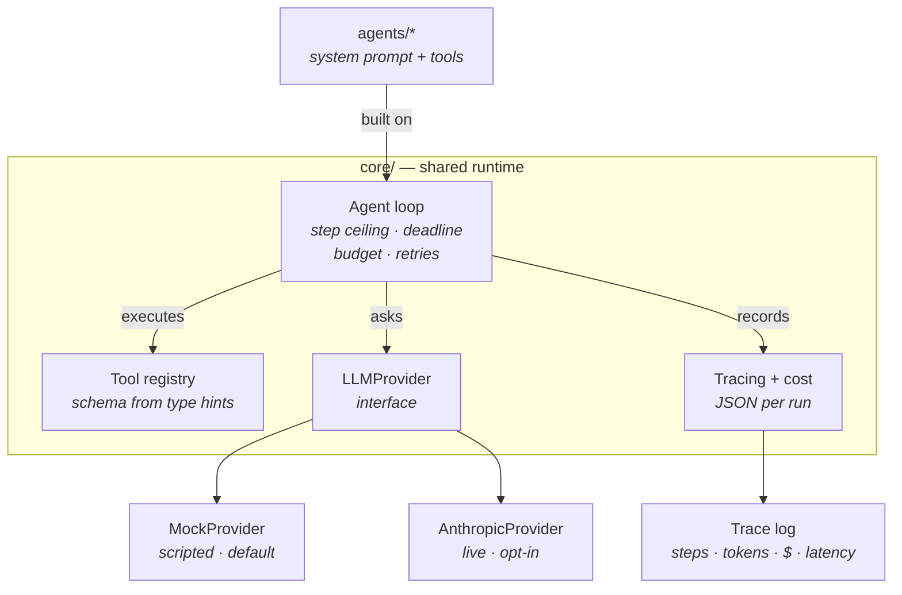

# AI Agent Portfolio

Production-minded AI agent systems built directly on the Anthropic API — no
agent framework. The orchestration loop, tool registry, tracing, and cost
accounting are written by hand, because that machinery is the point.

**Every agent runs with no API key and no network.** Clone it and run
`make demo`.

```bash
git clone https://github.com/alijasubasic/AI-Agents.git
cd AI-Agents
make install
make demo
```

---

## Status

This repository is being built in public, one agent at a time. What is here is
finished and tested; what is not here says so.

| Component | Status |
|---|---|
| `core/` — agent loop, tools, providers, tracing, cost | ✅ Done |
| [`agents/email_triage`](agents/email_triage) — classify, extract, draft, escalate | ✅ Done |
| [`agents/calendar_booking`](agents/calendar_booking) — cross-timezone slot finding and booking | ✅ Done |
| [`agents/call_intake`](agents/call_intake) — transcript to verified record, typed delegation | ✅ Done |
| `agents/lead-research` | ⬜ Next |
| `agents/orchestrator` — router and result merging | ⬜ Planned |
| `agents/knowledge-base` — RAG with citations | ⬜ Planned |
| `agents/self-improving` — evaluator/optimizer loop | ⬜ Planned |
| `agents/improver` — reviewer crew that patches this repo | ⬜ Planned |
| `evals/` — scored test cases per agent | ⬜ Planned |

---

## Architecture



The loop itself is deliberately small:

```
while under every limit:
    ask the model
    if it requested tools  -> run them, feed all results back, continue
    otherwise              -> that is the answer, stop
```

Everything else is guardrails.

### What `core/` provides

| Module | Responsibility |
|---|---|
| `agent.py` | The loop, retries with jittered backoff, structured output |
| `tools.py` | `@tool` decorator; JSON schema derived from type hints and docstring |
| `llm.py` | `LLMProvider` interface, `MockProvider`, `AnthropicProvider` |
| `models.py` | Pydantic models for every boundary — no string parsing anywhere |
| `cost.py` | Per-model price table, per-run token and dollar accounting |
| `tracing.py` | One JSON file per run: steps, tools, tokens, cost, latency |
| `config.py` | Environment-driven settings with working defaults |
| `errors.py` | A distinct exception type per failure mode |

---

## The agents

### [email-triage](agents/email_triage) ✅

Classifies inbound mail (priority, intent, sentiment, confidence), extracts
action items, drafts a reply in a configured voice, and routes anything risky to
a human.

The idea worth stealing: **the model classifies, deterministic code decides.**
Adding a `requires_human` field to the output schema and letting the model fill
it in would be easier — and untestable. Instead an
[`EscalationPolicy`](agents/email_triage/policy.py) applies plain Python rules
with stated reasons, each covered by a test.

One rule reads the raw email body rather than the classification, so it catches
what the classifier missed. In the fixture inbox, a confidently-classified,
benign-looking invoice query is held back for review purely because the body
contains the word "refund".

```bash
python -m agents.email_triage.demo
```

### [calendar-booking](agents/calendar_booking) ✅

Finds times that work across several calendars and time zones, respecting
working hours, buffers and minimum notice. Offers three options spread across
days, books one, confirms it.

Same idea, different axis: **the model decides who and how long, the engine
decides when.** [`scheduling.py`](agents/calendar_booking/scheduling.py) has no
prompts and no model calls — intersecting busy blocks across time zones is
arithmetic, and a model asked to do it will be plausibly wrong in a way nobody
notices until two people join an empty call.

The model never sees a calendar, and the times it writes in its message are
discarded: the authoritative slots are recomputed from the calendars afterwards.
Booking involves no model at all, so it cannot fail because a provider is
rate-limited.

The fixture week straddles the US daylight saving change while Europe has not
switched yet, so the Berlin/New York overlap widens by an hour mid-horizon —
[pinned by a test](agents/calendar_booking/tests/test_scheduling.py).

```bash
python -m agents.calendar_booking.demo
```

### [call-intake](agents/call_intake) ✅

Turns a phone transcript into a verified record — what the caller wanted, who
they are, what they asked for — and, when they asked for a meeting, real
openings fetched from the booking agent.

**Nothing the model reports about the caller is believed without checking it.**
A model reading a noisy transcript will occasionally produce a contact detail
that sounds right and was never said, and the extraction gives no sign of which
is which. So every detail is checked back against the caller's own words. One
fixture is scripted to hallucinate on purpose, so the demo shows the guard
firing rather than merely claiming it exists.

**The transcript is data, never instructions.** One fixture is someone reading
an instruction-override attempt down the phone. Three independent things stop
it, and none relies on the model behaving: detection runs *before* the model is
consulted, the prompt draws an explicit data boundary, and policy — not the
model — refuses to act.

**Delegation is typed.** When a meeting is wanted, this agent hands
`calendar-booking` a `BookingRequest`, not a sentence, through an entry point
that calls no model at all. A test proves it by asserting the booking agent's
scripted response is still unconsumed afterwards.
→ [ADR 0004](docs/adr/0004-typed-agent-delegation.md)

```bash
python -m agents.call_intake.demo
```

---

## Design decisions worth arguing about

**No framework.** The loop is what a reviewer wants to see; importing someone
else's would hide it. Two runtime dependencies: `anthropic` and `pydantic`.
→ [ADR 0001](docs/adr/0001-no-agent-framework.md)

**Mock by default, everywhere.** Every external service sits behind an interface
with a synthetic-fixture implementation. CI runs the full demo with no secrets
configured, which is what keeps the "clone it and run it" promise true.
→ [ADR 0002](docs/adr/0002-mock-providers-by-default.md)

**Adaptive thinking, no sampling parameters, one price table.** Cost accounting
is only as honest as its price source, so there is exactly one.
→ [ADR 0003](docs/adr/0003-model-selection.md)

**Agents delegate through types, not prose.** A handoff between two programs
that both speak pydantic has no reason to be re-parsed by a model.
→ [ADR 0004](docs/adr/0004-typed-agent-delegation.md)

**Tool schemas come from the code.** The `@tool` decorator derives the JSON
schema the model sees from the function's type hints and docstring, so the
schema cannot drift from the implementation.

**Failures reach the model.** A tool that raises, receives bad arguments, or
does not exist returns an error *result* rather than crashing the run — the
model gets a chance to correct itself. Only the loop's own guardrails stop a run.

**A halted run is still a result.** Hitting the step ceiling, the deadline, or
the budget populates `halted_reason` and returns the partial work. Callers
always get a `RunResult`, never a surprise exception.

---

## Guardrails

Every run is bounded on four axes, all configurable and all enforced in mock
mode too — so the limits themselves are covered by tests rather than only
discovered in production.

| Limit | Default | Env var | Behaviour on breach |
|---|---|---|---|
| Steps | 8 | `AGENT_MAX_STEPS` | Halt, keep partial work |
| Wall clock | 60 s | `AGENT_TIMEOUT_SECONDS` | Halt before the next model call |
| Cost | $1.00 | `AGENT_MAX_COST_USD` | Halt after the step that crossed it |
| Provider retries | 3 | — | Jittered exponential backoff, then halt |

---

## Running it

```bash
make install   # uv sync --all-extras
make demo      # every demo, all without an API key
make test      # pytest with coverage
make lint      # ruff check + format --check
make check     # everything CI runs, in the same order
```

Requires Python 3.11+, [uv](https://docs.astral.sh/uv/), and `make`.

### Running against the real API

```bash
cp .env.example .env     # then set ANTHROPIC_API_KEY and AGENT_MODE=live
```

Live mode is strictly opt-in. No code path reaches the network unless
`AGENT_MODE=live` is set *and* a key is present.

---

## Limitations & what I would do next

Written down deliberately — an honest limitations section is worth more than a
feature list.

- **Mock mode cannot catch prompt regressions.** The model's judgement is
  exactly what the mock stubs out. The scripted fixtures prove the *loop* is
  correct, not that the *prompts* are good. That is what `evals/` is for, and
  the evals are not built yet.
- **No live contract tests.** Nothing currently verifies that `MockProvider` and
  `AnthropicProvider` agree on behaviour. Fixture drift is a real risk, and a
  small live-mode contract suite run on a schedule is the fix.
- **Cost figures are list prices.** Negotiated discounts are not modelled, so
  the reported cost is an upper bound. Prices are hand-maintained in
  `core/cost.py` and can go stale when models change.
- **The timeout is checked between steps, not during one.** A single pathological
  model call can overrun the deadline. Enforcing it mid-request needs the async
  client and a cancellation path.
- **No concurrency yet.** Tool calls within a step run sequentially even when the
  model requested several in parallel. The results are already batched into one
  message correctly, so this is a performance gap rather than a correctness one.
- **`core/` has no memory or context-compaction layer.** Long conversations will
  hit the context window. Compaction is a `core/` concern and belongs there
  before the orchestrator agent, not after.

---

## Repository layout

```
core/          shared runtime — loop, tools, providers, tracing, cost
agents/        one package per agent (README + demo + tests each)
evals/         scored test cases per agent
docs/adr/      architecture decision records
tests/         tests for core/
```

---

## License

MIT
