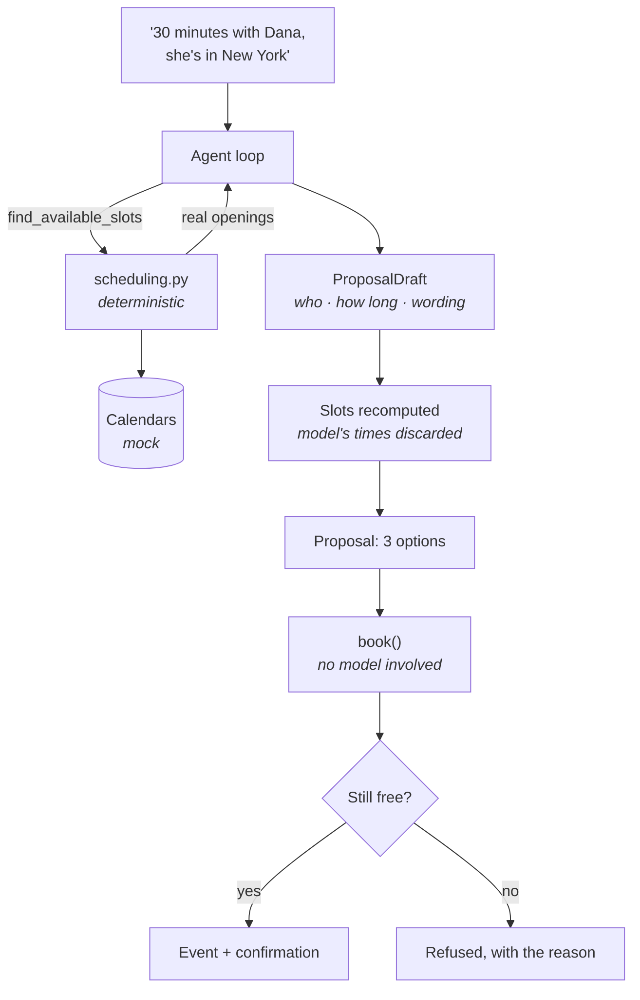

# calendar-booking

Finds times that work across several calendars and time zones, respects working
hours and buffers, offers three options, books one, and confirms it.

```bash
python -m agents.calendar_booking.demo
```

Runs on synthetic calendars with the clock pinned to Thursday 5 March 2026 — no
API key, no Google account, no network.

---

## The one idea worth taking from this agent

**The model decides *who* and *how long*. The engine decides *when*.**

Asking a language model to intersect busy blocks across time zones is asking for
something that will be plausibly, confidently wrong — and wrong in a way nobody
notices until two people join an empty call.

So [`scheduling.py`](scheduling.py) contains no prompts, no model calls, and no
randomness. Given the same calendars it returns the same slots every time, and
it is covered by 30-odd tests that can be checked against the calendar by eye.

The model reads the request, works out who needs to be there and roughly how
long, calls a tool, and writes the wording. It never sees a calendar and is told
so explicitly in its system prompt.



## Times are never parsed back out of prose

`ProposalDraft` — the model's structured output — contains the parsed request
and the message text. It deliberately does **not** contain the slots. Whatever
times the model wrote in its message, the authoritative list is recomputed from
the calendars afterwards.

If the engine finds nothing, the model's wording is discarded entirely and
replaced by a generated message. An empty result can therefore never be
described to a requester as a set of options.

## Booking involves no model at all

`propose()` uses the model. `book()` does not — it re-verifies the slot against
the calendars, creates the event, and renders the confirmation from a template.

Two reasons. Booking is the irreversible half, and it should not fail because a
provider is rate-limited. And a *generated* confirmation is a way for the text
to disagree with the booking it confirms; a rendered one cannot.

Re-verification matters: if someone books that time between the proposal and the
confirmation, the agent refuses and names the clash rather than double-booking.

## What the engine accounts for

| Constraint | Default | Note |
|---|---|---|
| Working hours | 09:00–17:00 | Per attendee, in **their** time zone |
| Working days | Mon–Fri | Per attendee |
| Buffer around meetings | 15 min | Applied on **both** sides, then merged |
| Minimum notice | 12 h | Stops the agent filling your next hour |
| Search horizon | 14 days | |
| Options offered | 3 | |
| Options per day | 1 | Three slots in one afternoon is one option |

A meeting must fit **entirely** inside one working day — finishing at 17:00 is
fine, 17:01 is not, and nothing may straddle midnight.

## Daylight saving is in the fixtures on purpose

The demo week was chosen because **US daylight saving starts on Sunday 8 March
2026, while European summer time does not start until the 29th.** The
Berlin/New York overlap therefore changes shape in the middle of the search
horizon:

| Day | Overlap (UTC) | Berlin | New York |
|---|---|---|---|
| Thu 5 – Fri 6 March | 14:00–16:00 | 15:00–17:00 CET | 09:00–11:00 **EST** |
| Mon 9 March onward | 13:00–16:00 | 14:00–17:00 CET | 09:00–12:00 **EDT** |

Same local hours on both sides, an hour's difference in UTC, and an hour more
overlap after the transition. `test_the_overlap_shifts_when_us_daylight_saving_begins`
pins exactly this. It is the sort of thing that is easy to get right with
`zoneinfo` and aware datetimes, and almost impossible to get right with offset
arithmetic — which is why the engine stores UTC and converts, and why naive
datetimes are rejected at the model boundary rather than quietly assumed to be
server-local.

## Design notes

**Buffers are applied before merging, not after.** Two meetings 20 minutes apart
with a 15-minute buffer leave no usable gap; padding first and merging second
makes that fall out automatically.

**Touching blocks merge; touching intervals do not overlap.** A block ending at
10:00 leaves 10:00 free as a start time, but 09:00–10:00 followed by 10:00–11:00
is one unavailable stretch. Both are tested, because getting one of them
backwards is the classic off-by-one here.

**Unknown attendees are skipped, not guessed.** Inventing working hours for an
address the calendar cannot resolve produces confidently wrong times.

**`describe_conflicts()` explains a refusal.** "That time is taken by the board
call" beats a bare no.

## Limitations

- **`GoogleCalendar` is unverified.** Nothing in CI touches it. Two problems are
  documented in the code rather than papered over: Google's free/busy API
  returns blocks with no titles, which would degrade `describe_conflicts()`, and
  it exposes no per-attendee working hours or time zone, so those need a
  directory lookup this agent does not have.
- **Candidate times are aligned in UTC.** For whole-hour-offset zones that lands
  on clean local quarter-hours. Zones at :30 or :45 offsets (Asia/Kolkata,
  Asia/Kathmandu) would get slots at odd local minutes. Aligning in the
  organiser's zone would fix it.
- **No recurring events.** Fixtures and providers model single blocks only. Real
  calendars are full of recurrence rules, and expanding those correctly is a
  meaningful piece of work.
- **No travel time, no room booking, no priorities.** Every busy block is
  equally immovable; in reality some meetings can be moved and the agent has no
  way to know which.
- **The scripted responses prove the plumbing, not the prompt.** Whether the
  model reliably extracts the right duration and attendees from a vague request
  is an evals question, and `evals/` does not exist yet.
