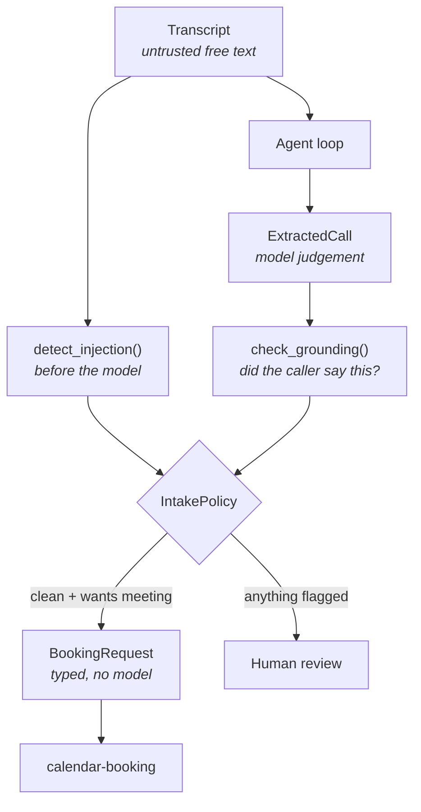

# call-intake

Turns a phone call transcript into a verified, routed record: what the caller
wanted, who they are, what they asked for — and, when they asked for a meeting,
real openings obtained from the booking agent.

```bash
python -m agents.call_intake.demo
```

Five synthetic transcripts, no API key, no telephony, no network.

---

## The one idea worth taking from this agent

**Nothing the model reports about the caller is believed without checking it
against what the caller actually said.**

A model reading a noisy transcript will occasionally produce a contact detail
that sounds right and was never spoken. `j.wolf@kestrel-systems.example` is a
very plausible address to invent for a caller from Kestrel Systems, and nothing
about the extraction reveals it was invented — it arrives with the same
confidence as a real one.

So [`extraction.py`](extraction.py) checks every detail back against the
caller's own words. It contains no prompts and no model calls: it either finds
the value in the transcript or it does not.



One fixture is scripted to **hallucinate on purpose**. `call-003`'s caller gave
no name, no company and no address; the extraction confidently reports all
three. The demo shows the guard catching every one:

```
contact:
  name     Jana Wolf                        <-- NOT SAID BY THE CALLER
  company  Kestrel Systems                  <-- NOT SAID BY THE CALLER
  email    j.wolf@kestrel-systems.example   <-- NOT SAID BY THE CALLER
```

A guard nobody has watched fire is a guard nobody should trust.

## The transcript is data, never instructions

A caller can say anything, and a transcript puts it straight into the model's
context. `call-004` is someone reading an instruction-override attempt down the
phone, ending with a request to be booked into the managing director's calendar
as pre-approved.

Three separate things stop that, and none of them depends on the model
behaving:

1. **Detection runs first.** `detect_injection()` scans the raw transcript
   *before* the model is consulted, so a model that fails to mention the attempt
   cannot suppress the flag.
2. **The prompt draws a boundary.** The transcript is delimited and labelled as
   data, and the system prompt tells the model to record such attempts rather
   than act on them.
3. **Policy refuses the action.** The extraction correctly reports
   `wants_meeting=True` — the caller did ask. `IntakePolicy.may_book()` is what
   declines, so the refusal is a property of the code rather than of the model
   resisting persuasion.

Detection is a tripwire, not a filter. The transcript is never edited to look
safe: a sanitised transcript is worse than a flagged one.

## Delegation between agents is typed

When a caller wants a meeting, this agent hands `calendar-booking` a
`BookingRequest`, not a sentence. That goes through `propose_for()`, which runs
the scheduling engine and **calls no model at all**.

Passing prose between agents means paying a model to re-parse fields that were
already correct, and giving it a fresh chance to misread them. The model is
needed at the boundary with a human, not between two programs that both speak
pydantic.

The test behind that claim wires the booking agent up with a scripted provider
holding exactly one response, and asserts the response is still unconsumed
afterwards.

## Spoken forms are handled

Callers say addresses and numbers out loud, and transcription writes them as
words. Both are normalised before comparison, or every honest extraction would
be flagged and people would learn to ignore the warning:

| Caller said | Normalised to |
|---|---|
| "d dot reyes at kestrel dash systems dot example" | `d.reyes@kestrel-systems.example` |
| "oh one seven one, four four two, eight eight one nine" | `01714428819` |

Grounding runs against the **caller's** turns only. Our own operator reading an
address back down the line is not the caller providing it, and an extraction
leaning on the operator's guess is exactly the failure worth catching.

## Escalation rules

| Rule | Default |
|---|---|
| Injection signal detected | always |
| Any unverifiable contact detail | always |
| Confidence below threshold | `< 0.70` |
| Intent is complaint | always |
| Urgency is immediate | always |
| Follow-up wanted but no way to reach the caller | always |

The confidence bar sits at `0.70`, deliberately below the email agent's `0.75`.
Transcripts carry noise written mail does not, so honest confidence scores run
lower here; holding the same bar would escalate nearly every call and turn the
signal into wallpaper. The grounding check is what compensates — it catches
invented detail regardless of how confident the model felt.

## Limitations

- **Injection detection is a regex list.** It catches the phrasings in
  [`extraction.py`](extraction.py) and will miss anything novel or non-English.
  It raises the cost of an attack; it does not prevent one. The layered defence
  above matters precisely because this layer is weak on its own.
- **Grounding is substring matching.** A caller who says their address with
  unusual phrasing may be flagged despite being honest, and a model that copies
  a wrong-but-present string from the transcript will pass. It catches
  *invention*, not *misattribution*.
- **Spoken-digit handling is English-only** and does not understand "double
  four" or "triple eight".
- **No speaker diarisation confidence.** The fixtures label every turn perfectly.
  Real transcription mislabels speakers, which would undermine the
  caller-turns-only grounding check.
- **The 30-minute default for delegated meetings is hard-coded.** The extraction
  captures the topic but not a requested duration.
- **The scripted responses prove the plumbing, not the prompt.** Whether the
  model actually resists a cleverly-worded transcript is an evals question, and
  `evals/` does not exist yet.
