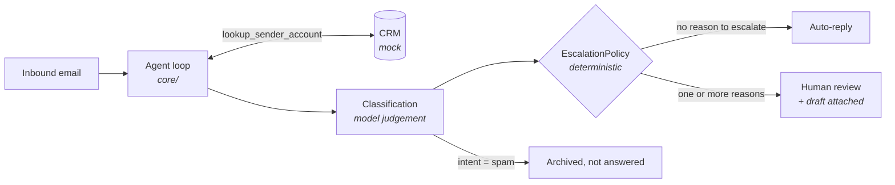

# email-triage

Classifies inbound business email, extracts action items, drafts a reply in a
configured voice, and decides what a human has to look at before anything is
sent.

```bash
python -m agents.email_triage.demo
```

Runs on synthetic fixtures with no API key, no mailbox, and no network.

---

## The one idea worth taking from this agent

**The model classifies. Deterministic code decides.**

It would be easy to add a `requires_human: bool` field to the output schema and
let the model fill it in. That is the wrong design. A language model asked
"should a human review this?" gives a slightly different answer on different
days, and its answer cannot be unit-tested.

So the model produces a `Classification` — priority, intent, sentiment,
confidence, tasks, draft. Then [`policy.py`](policy.py) applies rules in plain
Python. Every rule has a stated reason and a test.



## Escalation rules

| Rule | Default | Why |
|---|---|---|
| Confidence below threshold | `< 0.75` | A guessing model should hand over, not guess harder |
| Intent is complaint or legal | always | Never worth the risk of an automated reply |
| Sentiment is hostile | always | An angry customer needs a person |
| Priority is urgent | always | Speed matters more than automation here |
| Body matches a sensitive pattern | always | Catches what the classifier missed |

The body scan is the interesting one. It reads the **raw text**, not the
classification, so it fires even when the model was confident and calm about a
message. Patterns cover legal language, data-protection matters, contract
termination, money leaving the business, and public exposure risk.

Reasons **accumulate** rather than short-circuiting — someone opening an
escalation sees every rule that fired, not just the first.

### Spam is handled separately

Spam needs neither a human nor a reply. Auto-answering a cold sales blast
confirms the address is live, so it is filed and never answered — a distinct
path from escalation, not a special case of it.

## The fixture inbox

Six invented emails, chosen so every path fires at least once:

| Email | Classification | Outcome |
|---|---|---|
| Bulk pricing question | question / neutral / 0.92 | ✅ Auto-reply |
| Angry third chaser, mentions a lawyer | complaint / hostile / urgent | ⚠️ Human — 4 reasons |
| Possible duplicate invoice | invoice / neutral / 0.88 | ⚠️ Human — body scan only |
| Intro call request | scheduling / positive / 0.90 | ✅ Auto-reply |
| Cold sales blast | spam / 0.97 | 📁 Archived, no reply |
| "the thing we discussed" | request / **0.35** | ⚠️ Human — low confidence |

The duplicate-invoice case is the one to look at: the classification is
confident and the intent is benign. Only the word "refund" in the body stops it
from being answered automatically.

## Design notes

**Classification and routing are separate types.** `Classification` is what the
model returns; `TriageResult` is that plus the routing decision and what the run
cost. Keeping them apart makes it obvious which fields a model can influence.

**Triage does not send.** `triage()` classifies; `send_if_allowed()` sends. An
agent that classifies and sends in one call leaves the caller nowhere to stand
between the decision and its consequence.

**A halted run never auto-sends.** If the loop hit its step limit, budget, or a
provider failure, the result is not trusted regardless of what it contains.

**Every external service sits behind a `Protocol`.** `MailboxProvider` and
`CrmProvider` each have a fixture-backed mock and a real implementation.

**Field descriptions are prompt text.** The descriptions on `Classification` are
what the API sends to the model as the output schema, so they are written as
instructions rather than as documentation for a reader.

## Limitations

- **`GmailMailbox` and `HttpCrm` are unverified.** Nothing in CI exercises
  them — that would need a real Google account and a real CRM. They carry the
  interface shape and raise `NotImplementedError` where a live call belongs.
  Everything tested here runs against the mocks.
- **The scripted responses prove the plumbing, not the prompt.** The fixtures
  show that the loop, the tools, and the policy behave correctly given a
  well-formed classification. Whether the model *produces* good classifications
  is a separate question, scored in [`evals/`](../../evals) at the
  JUDGEMENT layer — which needs a live API key.
- **The body scan is regex over English.** It will miss paraphrases ("we'll be
  seeking legal advice" is caught, "our counsel will be in touch" is not) and it
  does not handle German, which real inbound mail here would contain. It is a
  safety net under the classifier, not a classifier of its own.
- **No thread history.** Each email is judged alone. The angry third chaser
  reads as a first complaint because the agent cannot see the two before it.
  Threading is the single highest-value addition to this agent.
- **The voice profile is a constant.** It should be learned from sent mail, not
  hand-written in [`fixtures.py`](fixtures.py).
