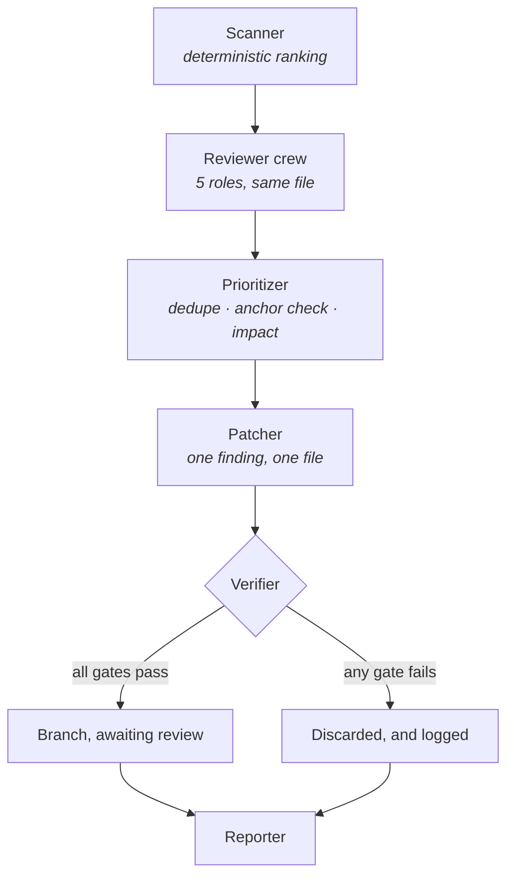

# improver

Reviews this repository, proposes patches, and verifies them against a gate it
cannot influence. Every applied patch is a branch. Nothing is merged.

```bash
make improve              # dry run: scan, review, report a worklist
make improve APPLY=1      # also write patches, on branches
python -m agents.improver.demo
```

---

## The one idea worth taking from this agent

**A code-writing agent's worst failure is not writing bad code. It is writing
bad code and adjusting whatever would have caught it.**

A weakened assertion. A loosened lint rule. A deleted eval case. Each one makes
the next run look cleaner and the repository worse, and each is a change a
well-meaning model can rationalise — *this test was too strict, this rule does
not apply here*. Nothing about the resulting diff looks like sabotage.

So every guardrail in [`safety.py`](safety.py) points at the improver itself:

| It may never modify | Why |
|---|---|
| `tests/`, and any `tests/` beside an agent | The thing that says its patch works |
| `evals/` | The thing that says the agents still behave |
| `.github/` | The thing that runs both |
| `Makefile`, `pyproject.toml`, `uv.lock` | The thing that defines what "passing" means |
| `docs/adr/` | The reasoning behind its own constraints |
| **`agents/improver/`** | Itself |

Not "is instructed not to". *Cannot* — `check_patch` runs before anything
reaches the workspace and refuses on a path match, consulting nothing.

The rules are deliberately blunt. A blunt rule that occasionally refuses a good
patch costs somebody two minutes; a subtle rule with a hole in it costs the
integrity of every number in the repository.

**The demo found a hole in exactly that way.** `normalise()` used
`path.lstrip("./")`, and `lstrip` strips a *set of characters* rather than a
prefix — so `.github/workflows/ci.yml` became `github/workflows/ci.yml` and the
CI rule silently stopped matching. CI configuration was unprotected until the
demo printed a refusal that was not there. It is now a test and an eval case.

## The pipeline



**Scanner.** Deterministic, so which files get reviewed is a decision somebody
can inspect and disagree with rather than a model's taste. Each entry carries
its `priority_reasons`. Protected and self files score zero and are never
candidates: reviewing them would spend the budget producing findings nothing
may act on.

**Reviewer crew.** Five reviewers read the same file for five different things
— correctness, security, robustness, readability, agent quality. Running them
separately is the point: one "review this file" prompt returns a list dominated
by whatever the model noticed first, and the categories nobody asked about go
unmentioned. A crew missing a reviewer is refused at construction, because
silently dropping one stops checking a whole category.

Every reviewer is told that most findings are minor and that an empty result is
a valid answer. A reviewer that never finds nothing is one nobody believes when
it finds something.

**Prioritizer.** Deduplicates — and two reviewers independently flagging the
same line *raises* the severity rather than discarding one, because that is the
strongest signal this pipeline produces. Nits are collected, never queued: a
branch per nit produces ten reviews nobody wants.

It also drops any finding whose quoted anchor is not actually in the file. A
reviewer quoting something that is not there did not read the file carefully,
and patching from that is how a working function gets broken.

**Patcher.** Whole files, not diffs. A unified diff that applies cleanly to the
wrong place is a class of bug that does not exist if the agent has to write out
what it means the file to contain. Declining to change anything is an explicit,
recorded outcome — a finding that turns out to be wrong should produce no
patch, not a plausible one.

## The gate

Six checks, cheapest first, stopping at the first failure. Nothing here
consults a model: a verifier a model could argue with is not a verifier.

| Gate | Checks |
|---|---|
| `SAFETY` | May this patch exist at all |
| `SCOPE` | Did it touch only what the finding named |
| `REGRESSION_TEST` | A blocker or major fix ships with a failing-first test |
| `LINT` | `make lint` |
| `TESTS` | `make test` |
| `EVALS` | The eval score did not change |

Stopping early is right here, unlike elsewhere in this repository: the later
gates run a full test suite, and running it to add detail to a patch that was
already refused wastes minutes for nothing.

**The eval gate is the one worth explaining.** `make test` answers "does the
code still work"; it says nothing about whether the agents still *behave* well,
because most of that behaviour is not a unit test. A patch that improves a
function and lowers the eval score has made the repository worse in a way tests
cannot see.

**Regression tests are written, not added.** The improver cannot write into
`tests/`, so it produces the test for a person to paste in. No test, no bug fix.

## The demo touches nothing

The **scan** runs against this repository for real, because reading files
cannot hurt anything — what it prints is the genuine ranking.

The **patch** stage runs entirely in memory against a synthetic file. A demo of
a code-modifying agent that modified the repository it was demonstrating in
would be an unpleasant surprise, and "it only creates a branch" is not
reassurance enough to rely on. An eval case asserts the repository is unchanged
afterwards.

It shows all three outcomes, because a pipeline that only ever succeeds tells
you nothing about whether its gates work:

```
[ applied ] Discount treats a percentage as a fraction
             all gates passed on improve/2026-03-06-discount-treats-a-percentage-as-a
[ reverted] A negative quantity silently produces a negative line total
             tests gate: make test failed
```

## Limits

| | Default |
|---|---|
| Patches per run | 10 |
| Characters per patch | 6,000 |
| Files per patch | 3 |
| Cost per run | $5.00 |

## Weekly, in CI

[`.github/workflows/improve.yml`](../../.github/workflows/improve.yml) runs it
on Mondays **in dry-run mode** and opens a pull request containing the report
and nothing else. Applying patches unattended on a schedule would mean branches
appearing in a repository nobody was watching; `make improve APPLY=1` is the
deliberate, local action.

## Limitations

- **`GitWorkspace` is the one thing here that can damage a working tree**, and
  it is not covered by tests — exercising it would mean creating branches and
  running subprocesses in a real repository, which is what nothing in CI should
  do. It refuses to start from a dirty tree, because discarding on a failed
  patch would take somebody's work with it.
- **The scanner cannot see indirect tests.** It looks for `test_<name>.py`, so
  `core/llm.py` ranks as untested while being thoroughly exercised through
  `tests/test_agent.py`. Coverage data would answer this; a filename convention
  cannot. Scored as a known gap.
- **One finding, one file.** That keeps patches reviewable and rules out a whole
  category of useful change: a misleading name cannot be fixed without touching
  every caller, so the improver reports it and stops.
- **The eval gate compares a line of text.** Any change to the overall row fails
  it, including an improvement. Deliberately conservative, and still a string
  comparison standing in for a measurement.
- **No memory between runs.** A finding refused last week is proposed again this
  week. The log records what was attempted; nothing reads it back.
- **The reviewers see one file at a time.** A problem that only exists in the
  relationship between two modules is invisible to all five of them.
