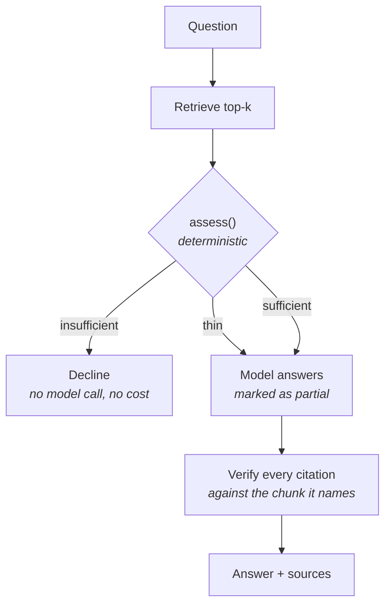

# knowledge-base

Answers questions from a corpus of customer documents, with a citation for
every sentence — or says honestly that the documents cannot answer.

```bash
python -m agents.knowledge_base.demo
```

Four questions against a synthetic corpus. No API key, no network, no vector
database.

---

## The one idea worth taking from this agent

**"I don't know" is a verdict the code reaches, not a behaviour the prompt asks
for.**

Retrieval-augmented generation fails in a characteristic way. The retriever
always returns something, because "least irrelevant" is the only thing a
similarity search can compute. Ask a corpus of hardware policies about parental
leave and it hands back three paragraphs about support hours. Pass those to a
model with "answer the question" and you get a confident, well-cited, entirely
invented answer.

**The failure has exactly the shape of a success.** Nothing downstream can tell
them apart, which is why the check has to happen upstream.

So [`retrieval.py`](retrieval.py) assesses the retrieved context *before* the
model is consulted, and it can refuse. For a question the corpus cannot answer,
the model never sees the question — so it never gets the chance to be helpful
about it.



## The gate

Three signals, and the middle one is the interesting one.

| Signal | Default | What it catches |
|---|---|---|
| Noise floor | best match ≥ `0.10` | Nothing in the corpus is even close |
| **Separation** | best ≥ `1.5×` the rest | The words appear everywhere and answer nothing |
| Term coverage | ≥ `50%` of question terms | A chunk scoring well while missing the key word |

**Separation replaced an absolute similarity threshold**, and the replacement
came out of running the thing. TF-IDF cosine *falls as a question gets longer*,
because extra terms dilute the query vector — so a fixed floor quietly punishes
people for asking in full sentences. The first run of this agent refused

> "How long is the warranty on standard hardware, and what does it exclude?"

at `0.166` against a `0.18` floor, on a corpus whose first document answers it
in the opening sentence. A well-answered question instead shows one chunk
clearly ahead of the field whatever the absolute numbers are, and that ratio is
stable across question lengths. A test pins it: the same question asked briefly
and at length must both pass.

`THIN` is a third verdict between yes and no. The answer is allowed and the
reply carries what the retrieval did not cover, which is more useful than
either refusing outright or pretending the coverage was complete.

## Every sentence cites a chunk, and every citation is checked

Same idea as [`lead-research`](../lead_research), one level down. Two ways to
fail, kept apart because they mean different things:

- `UNRETRIEVED` — cites a chunk id that was never retrieved. The model invented
  the id.
- `UNSUPPORTED` — cites a real chunk that does not contain the quote. The model
  invented the support.

The demo shows the second one firing. Asked how quickly a key account gets a
response to a warranty claim, the scripted answer is **factually right** and
attributes half of it to the returns document, which says nothing of the kind:

```
verified citations:
  ok  doc-support#0      "Key accounts receive priority support with a four-ho..."

rejected citations:
  !!  doc-returns#0      unsupported: "Standard support covers configuration questi..."
```

That is what a real model does when an answer spans two documents and it loses
track of which said what. The fact survives; the attribution does not — and a
document reached only by a rejected citation is not listed as a source.

## Chunking

Deterministic and dependency-free. Ids are `{document}#{ordinal}` and depend
only on the document and the settings, so re-indexing an unchanged corpus
produces identical ids and a citation written last week still resolves.

Two rules:

- **Split on paragraph boundaries first.** A chunk beginning mid-sentence reads
  as nonsense when quoted back to a user, which is the one place chunks are
  seen by a human.
- **Overlap by whole sentences.** An answer sitting across a boundary is the
  classic RAG failure; overlapping by *characters* would cut sentences in half
  to solve it, reintroducing the first problem.

When the two conflict — an overlap that would push a chunk over the size limit
— the overlap is dropped. The limit is a guarantee; the overlap is a nicety.
Both bugs in that interaction were caught by tests rather than by a user.

## Retrieval is lexical, and this README says so

`LexicalEmbedder` is not a mock. It is real TF-IDF retrieval with cosine
similarity, in pure Python, with no network and no dependency. But it is
**lexical**: it finds documents that share *words* with the question.

It will not find the returns policy when someone asks "how much warning must I
give before sending something back", because that sentence shares almost no
vocabulary with the document that answers it. A hosted embedding model would.

The trade is deliberate: offline operation, exact eval scores, and no billing —
against genuinely worse recall on paraphrased questions.
[`VoyageEmbedder`](embedding.py) is the seam for changing that mind, and
switching would cost the exactness: retrieval would become sampled, and every
eval asserting a ranking would have to become a tolerance.

## Limitations

- **Lexical retrieval misses paraphrases.** Scored as a known gap in
  [`evals/`](../../evals), not just described here.
- **No stemming.** "exclude" and "excludes" are different terms, which is
  visible in the demo: the warranty question is marked `THIN` partly for that
  reason. A stemmer would fix it in about ten lines.
- **Citations are checked for existence, not entailment.** A real quote
  supporting a wrong sentence passes. Catching that needs an entailment model,
  which would put a second model in the verification path — and a verifier that
  can hallucinate is not obviously better than none.
- **The index is a linear scan.** Microseconds for a few thousand chunks and
  entirely wrong for a few million, which would need a real vector store.
- **Thresholds are tuned against this corpus.** `0.10`, `1.5×` and `50%` were
  chosen by measuring the fixtures. A different corpus would need them
  re-measured, and nothing here helps with that.
- **No conversation.** Each question is answered alone; there is no follow-up,
  no "what about the other one", no memory of what was already retrieved.
