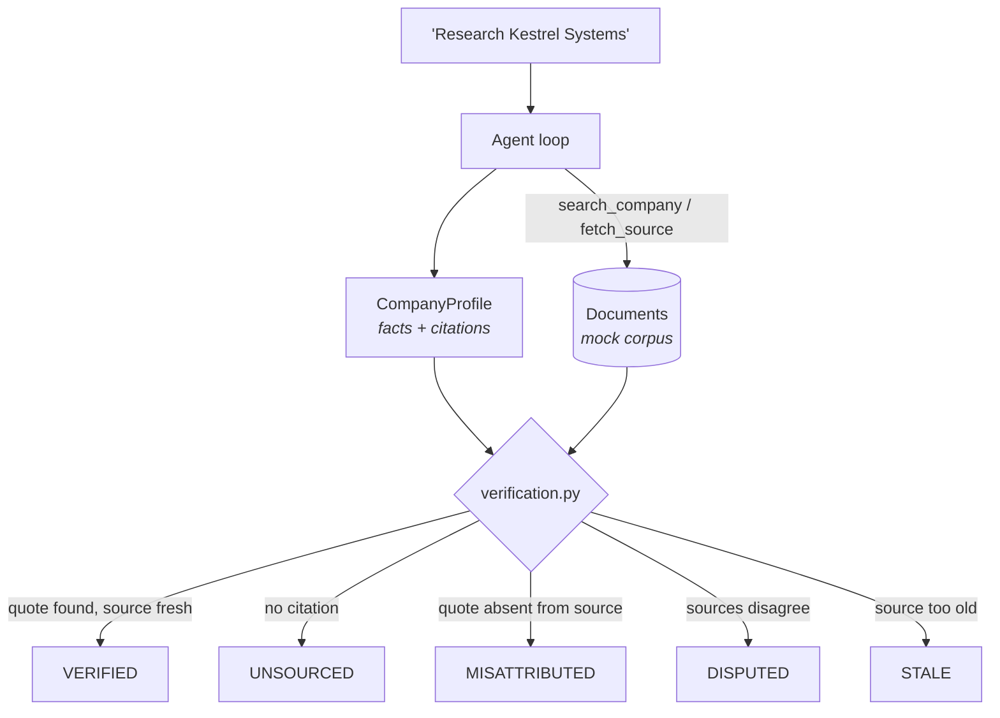

# lead-research

Researches a company, extracts structured facts with citations, and labels every
claim by how well the retrieved documents actually support it.

```bash
python -m agents.lead_research.demo
```

Three companies against a synthetic corpus. No API key, no network.

---

## The one idea worth taking from this agent

**Research is the easiest task in this repository to fake convincingly.**

Ask a model about a company and it produces a tidy profile whether or not it
read anything. A plausible headcount is exactly as cheap to generate as a real
one, and the output looks identical either way. Confidence is not evidence.

So the unit of output is not a profile — it is a **fact with a citation**, and a
separate pass in [`verification.py`](verification.py) decides what each one is
worth. The model proposes; deterministic code labels.



## The five labels

Checked in this order; the first that applies wins.

| Label | Meaning |
|---|---|
| `UNSOURCED` | No source cited. The model may be right; there is no evidence. |
| `MISATTRIBUTED` | A source was cited but does not contain the quoted sentence. |
| `DISPUTED` | Another retrieved source gives a different value for the same field. |
| `STALE` | Verified, but the document is more than 18 months old. |
| `VERIFIED` | The quote was found in a document that was actually retrieved. |

Only `VERIFIED` means "we found this written down". Everything else is a caveat
the reader must see, so the report keeps them in a **separate section** rather
than footnoting them inline — a caveat you can skim past is not a caveat.

`UNSOURCED` is deliberately not treated as a model failure. Plenty of things are
not on the public web, and a model that says so is behaving correctly. The
failure would be presenting such a claim as though it were sourced.

Nothing is silently deleted either. An unsupported claim is kept and labelled,
because dropping it would hide that the model produced it at all — and that is
information about the model.

## The demo trips every label on purpose

The corpus is built around the problems real research runs into, not a clean set
of agreeing pages. Kestrel Systems has four documents that between them produce
all five outcomes:

| Claim | Label | Why |
|---|---|---|
| founded: 2017 | ✅ `VERIFIED` | Quote found on the company site |
| funding: $12M Series A | ✅ `VERIFIED` | Quote found in the press release |
| headcount: around 20 | `STALE` | Only available from a 2021 article — 57 months old |
| headquarters: New York | `DISPUTED` | The company site says New York… |
| headquarters: Boston | `DISPUTED` | …a directory listing says Boston |
| ceo: Marisol Trent | `MISATTRIBUTED` | Attributed to a page that never names a CEO |
| revenue: ~$8M ARR | `UNSOURCED` | A plausible figure with nothing behind it |

**2 of 7 claims survive.** The CEO and revenue entries are scripted model
failures — they are what a real model does on a thin corpus, and the point is
that neither reaches the reader unlabelled.

A second company, Halvard Marine, has a single two-year-old directory listing:
**nothing** verifies, and the useful output is the list of open questions. A
third does not appear in the corpus at all, and the search tool's empty response
explicitly tells the model to report that rather than answer from memory.

## Design notes

**Quote matching is strict.** Substring comparison after whitespace
normalisation — a paraphrase fails. The schema asks the model to copy a sentence
verbatim, so a model that can only paraphrase should be reporting no source, not
an approximate one.

**Verification runs against what retrieval returned**, not against the ids the
model mentioned. A claim citing a document that was never fetched is exactly the
failure worth catching, and checking against the model's own list would miss it.

**Disputes name both sides.** Neither value wins. The reader is told there was a
disagreement at all, which is the fact that actually matters to them.

**Only some fields can be disputed.** Two sources describing a `sector`
differently are both fine; two placing the head office in different cities are
not. The contested set is explicit in `verification.py`.

**A missing publication date is not evidence of age.** Undated documents are
verified, not flagged stale. Real pages often carry no date.

**The report is rendered, not generated.** No model call, so the prose cannot
disagree with the labels it is describing.

## Limitations

- **`WebSearch` is unverified**, and the code records two specific problems
  rather than glossing over them. Real retrieval returns HTML that must be
  converted to text before a quote can be matched, and that conversion decides
  whether verification works at all. Real pages also carry no reliable
  publication date, so the staleness check would quietly stop firing — worse
  than not having it, because the report would still look verified.
- **Substring matching catches invention, not misreading.** A model that copies
  a real sentence but draws the wrong conclusion from it passes verification.
  The quote is checked; the inference from quote to value is not.
- **Source quality is recorded but not used.** `SourceKind` distinguishes a
  company's own site from a directory scrape, and nothing currently weights them
  differently. A self-reported headcount and a registry filing are not equally
  good evidence.
- **The staleness threshold is one number for every field.** A founding date
  does not go stale the way a headcount does, and treating them alike produces
  the occasional silly flag.
- **No entity resolution.** "Kestrel Systems" and "Kestrel Systems Inc." are
  different companies as far as this agent is concerned.
- **The scripted responses prove the plumbing, not the prompt.** Whether a real
  model reliably cites verbatim rather than paraphrasing is an evals question,
  and `evals/` does not exist yet.
