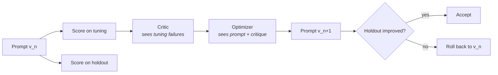

# self-improving

An evaluator-optimizer loop: a critic reads what a prompt got wrong, an
optimizer rewrites it, and a gate decides whether the rewrite was actually
better.

```bash
python -m agents.self_improving.demo
```

Improves a routing prompt over three iterations against a fixture task. No API
key, no network.

---

## The one idea worth taking from this agent

**A self-improving loop is easy to build and easy to build wrong.**

The wrong version rewrites its prompt, measures the result on the same examples
it was shown, watches the number go up, and reports success. What it has
learned is those examples. Every number it produces after that is flattery.

So the cases are split. The **tuning** half is shown to the critic and the
optimizer; the **holdout** half is shown to neither, and acceptance is decided
on the holdout alone. A `PromptTask` with no holdout cannot be constructed —
the constructor raises, because a loop without one measures nothing.



## The run tells the story

```
version     tuning   holdout     gap   outcome
v0            50%      50%     +0%   baseline
v1            75%      75%     +0%   ACCEPTED
          holdout rose from 50% to 75%
v2           100%      75%    +25%   rejected
          holdout unchanged at 75% while tuning rose to 100% — the prompt learned the examples
v3           100%      50%    +50%   rejected
          holdout fell from 75% to 50%
```

**v2 is the version this design exists for.** It is perfect on the eight cases
it was shown and no better on the four it was not. It would have looked like
the best version of the run, and it is the worst kind of failure — the kind
that reports success.

Looking at what the optimizer actually wrote makes it obvious. v1 stated a
*rule*:

> billing: money already owed or paid — sales: money not yet committed

v2 listed the *situations it had seen*:

> billing: invoices, statements, credit notes, payment terms, duplicate
> charges, missing credit notes, requests for past statements

Both score 100% on tuning. Only one of them knows what to do with a message
nobody has shown it. The `overfit_gap` column is the difference between
learning a task and memorising a test.

## Design notes

**A rejected version is not built on.** Each proposal starts from the best
*accepted* prompt, so a bad step is rolled back rather than compounded — hill
climbing, not a random walk. `v3`'s parent is `v1`, not `v2`.

**The baseline is always kept.** A run that accepts nothing still has an
answer: the prompt it started with. `best` returns the baseline in that case
rather than `None`.

**Scoring is deterministic.** Using a model to grade the output of a loop whose
purpose is improving prompts would make the improvement signal itself sampled —
the number could move because the grader had a different day, and nobody could
tell that apart from a real gain.

**A missing answer scores zero rather than being skipped.** Silently dropping
it would let a prompt raise its average by failing to respond.

**The critic is told it sees a sample.** It is asked for the *pattern* behind
failures, not a list of them, because a prompt patched with individual examples
is how you produce v2 on purpose.

## Limitations

- **The holdout erodes with reuse.** Every acceptance decision leaks a little
  information about the holdout into the surviving prompt. Over many runs the
  split stops being held out. A real system rotates cases or budgets decisions
  per split; this one does neither, and it is a scored known gap rather than an
  unmentioned one.
- **One metric.** Acceptance looks at exact-match accuracy and nothing else, so
  a prompt three times longer wins on a one-case gain. Latency, token cost and
  length are invisible to the gate.
- **One sample per version.** Deterministic in mock mode and misleading in live
  mode: a single pass over four holdout cases cannot distinguish a real
  improvement from sampling variance. Repeated trials with a confidence
  interval are what this needs before a live number means anything.
- **The holdout is tiny.** Four cases means the smallest possible score change
  is 25 percentage points. Real use needs enough cases that a one-case
  difference is not a quarter of the metric.
- **It improves prompts, not code.** Rewriting the instructions is the whole
  scope. Changing the tools an agent has, or the policy around it, is the
  [`improver`](../improver)'s job and a much larger problem.
