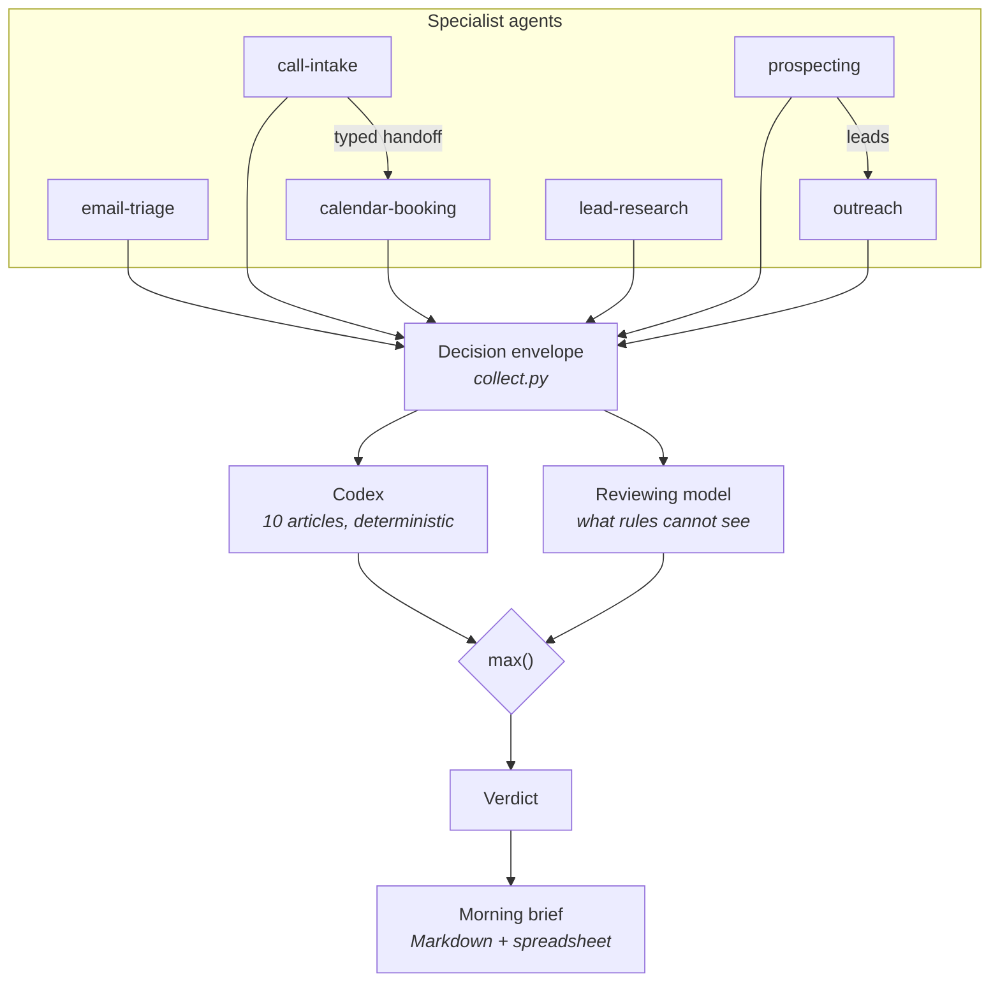

# supervisor

The supervising agent. Runs every other agent, reviews what each of them
decided, and writes the morning brief.

```bash
python -m agents.supervisor.demo
```

Drives all four specialists over their fixtures, puts 17 decisions through the
codex and a reviewing model, and writes the brief as Markdown and as a
spreadsheet. No API key, no network.

---

## The one idea worth taking from this agent

**The supervisor can only ever be more conservative than the agent it supervises.**

This is the whole reason it is safe to add. An oversight layer that can also
*approve* things is not oversight — it is a second opinion with veto power over
the first, and the moment it talks itself past a guard that fired for good
reason, the system is less safe with supervision than without it.

So `Verdict` is an ordered enum, and every reviewer's opinion is combined with
`max()`:

```python
verdict = max(codex_verdict, model_verdict)
```

Nothing in the chain can lower what another link raised. That is a property of
the type, not a promise in a prompt — and
[`test_supervisor.py`](tests/test_supervisor.py) checks it exhaustively over
every combination of codex outcome and reviewer opinion.

Article A1 makes the same guarantee at the other end: a specialist agent's
escalation is final, and the supervisor may not overturn it.

## The codex is executable, not a prompt

A supervisor whose principles live in its system prompt has no principles. It
has a suggestion that a long context, an unusual phrasing, or a model upgrade
can quietly erode. Nothing in [`codex.py`](codex.py) asks a model anything.

| Article | | Verdict | Catches |
|---|---|---|---|
| **A1** | Human authority | hold | A specialist already routed this to a person |
| **A2** | Honesty | **block** | Outbound text repeats a claim that failed verification |
| **A3** | No unbacked commitments | hold | Prices, guarantees, deadlines, discounts |
| **A4** | Confirmed recipient | **block** | Writing to an address nobody confirmed |
| **A5** | Data minimisation | hold | Someone else's contact details inside a message |
| **A6** | Fair dealing | hold | Pressure selling, manufactured urgency |
| **A7** | Cost discipline | hold | One decision over the per-decision ceiling |
| **A8** | Auditability | hold | No trace reference to reconstruct it from |
| **A9** | Lawful contact | **block** | Cold-mailing an address the business never published |
| **A10** | Right to be left alone | **block** | An opt-out ignored, or no way to opt out at all |

The split between *block* and *hold* is deliberate. Dishonesty and unconfirmed
recipients destroy the decision. Everything else holds it for a person, because
most of what those articles catch is a draft that needs an edit rather than
something that must not happen.

A9 and A10 apply only to `COLD_OUTREACH` — writing to somebody who never wrote
to us. Replying to a customer is a different act with different requirements,
and A4 already covers the recipient question there. Both block rather than hold,
because a first contact that fails one of them cannot be repaired by editing it
after it has arrived.

Findings accumulate rather than short-circuiting: a reviewer should see
everything wrong with a decision at once, not the first thing that happened to
be checked.

## What the model is for

The codex cannot see whether a reply misses the point, whether a tone would
damage a relationship, or whether a commitment was made too casually. That is
what the reviewing model is asked, and it is asked in a deliberately narrow
way: it reports concerns and says whether a person should look. **It never
decides whether something is approved.**

In the demo it earns its place once. The scheduling reply to `msg-004` breaches
no article — no price, no pressure, a confirmed recipient — and the model holds
it anyway:

> the draft names a specific time and says an invite will follow, before the
> calendar has been checked

No rule could have caught that. The model also cannot do the reverse: its
opinion is combined with `max()`, so a relaxed reviewer changes nothing.

Once the codex has already blocked a decision the model is skipped entirely.
Nothing an opinion could say would change a block, so paying for one would buy
nothing.

## The chains close

The interesting failures are the ones no single agent could have caught,
because each half looked reasonable on its own.



**An invented figure reaching a prospect.** `lead-research` labels a revenue
number `UNSOURCED` and reports it honestly. An outreach draft written from that
profile repeats it to the customer as fact. Neither agent did anything wrong;
**A2 blocks the send.**

**An email to an address nobody said.** `call-intake` establishes that a
caller never actually spoke the address the model extracted. A follow-up is
drafted to it anyway. **A4 blocks the send.**

**Pressure selling.** A draft guarantees a discount and manufactures a
deadline. A3 and A6 both fire — and it is *held*, not blocked, because the
problem is the wording rather than the intent.

**A guessed address.** `prospecting` labels an address `CONSTRUCTED` because a
pattern built it from a name; `outreach` writes a perfectly good email to it, in
the absence of anything better. **A9 blocks the send.**

**The best lead in the campaign.** Three platforms, a named managing director, a
confirmed personal address — and a request in 2025 not to be contacted. The
email is faultless. **A10 blocks it anyway.**

## Running a campaign

[`campaign.py`](campaign.py) is the supervisor steering the outbound pair the way
`pipeline.py` steers the inbound ones: search an area with `prospecting`, hand
each business to `outreach` for a draft, review every decision, and send exactly
the ones that survived — which in dry-run mode is none of them.

The two specialists never talk to each other. Prospecting does not know outreach
exists, outreach cannot search for anything, and neither can send. The supervisor's
approval is the only route from finding a business to writing to it.
→ [ADR 0007](../../docs/adr/0007-three-yesses-before-an-email.md)

```bash
python -m agents.supervisor.campaign_demo                      # fixtures, nothing sent
make leads WHAT="Dachdecker" WHERE="München" OUTREACH=1   # the real platforms
```

## The morning brief

Two questions, and nothing else: what happened yesterday, and what needs a
person today. Anything that serves neither is noise at eight in the morning.

Written by [`reporting.py`](reporting.py) with no model call, so the prose
cannot disagree with the numbers next to it. Only decisions that did **not**
go through become tasks — listing the approved ones would bury the handful that
actually need someone.

Four tabs: `Summary`, `Decisions`, `Tasks today`, `Codex findings`.

CSV is the default and needs nothing installed; `.xlsx` needs the optional
`xlsx` extra. The CSV writer defaults to semicolons and writes a UTF-8 BOM,
because without both, Excel on a German locale mangles the file.

## Limitations

- **The codex encodes one company's judgement.** A1 and A2 generalise; A3 and
  A6 are opinions about how *this* business talks, and a different company
  would want different articles. They are meant to be edited, which is part of
  why they are code.
- **A2 catches repetition, not paraphrase.** A draft that restates an unsourced
  figure in different words passes. Substring matching finds the copy-paste
  case, which is the common one, and misses the rest.
- **A6 is a regex list over English.** It raises the cost of pressure selling;
  it does not prevent it. Non-English drafts get no protection at all.
- **The monotonicity guarantee is about verdicts, not about the world.** The
  supervisor cannot approve something a specialist held. It also cannot notice that
  the specialist was wrong to hold it, so a false escalation stays escalated
  forever. That trade is deliberate, but it has a cost: over-cautious agents
  generate work rather than saving it.
- **Tasks have no owner and no due date.** Everything lands as `unassigned`.
  Routing to a real person needs a directory this repository does not have.
- **The brief is generated, not scheduled.** Running it every morning is a cron
  job or a scheduled task, and setting one up is a decision for whoever owns
  the machine.
- **The reviewing model sees one decision at a time.** It cannot notice that
  four separate emails yesterday all promised the same customer a callback.
  Cross-decision patterns are exactly what a supervisor should catch, and this
  one does not yet.
